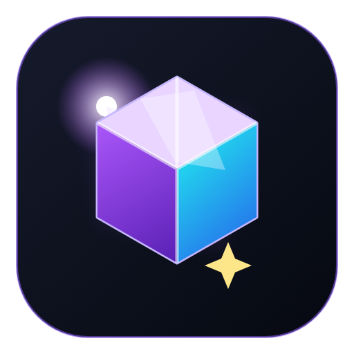
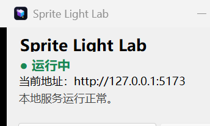
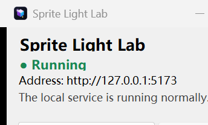

# Sprite Light Lab

**简体中文** | [English](README_EN.md)

> [!IMPORTANT]
> **普通用户只需要下载 EXE，不需要下载源代码。**
>
> GitHub 页面中的 `Source code (zip)` 和 `Source code (tar.gz)` 仅供开发者查看或二次构建使用。
>
> **[直接下载 SpriteLightLab-v1.0.5-win-x64.exe](https://github.com/IAld010/SpriteLightLab/releases/download/v1.0.5/SpriteLightLab-v1.0.5-win-x64.exe)**

<p align="center">
  
</p>

<p align="center">
  本地运行的 2D 精灵资源快速预览工具，支持 Palette Swap 与法线光照效果调整。
</p>

<p align="center">
  <a href="https://github.com/IAld010/SpriteLightLab/releases/latest"></a>
  <a href="LICENSE"></a>
  
</p>

## 下载与运行

Windows 用户可以直接下载自包含单文件版本：

<p align="center">
  <a href="https://github.com/IAld010/SpriteLightLab/releases/download/v1.0.5/SpriteLightLab-v1.0.5-win-x64.exe"><strong>下载 SpriteLightLab v1.0.5</strong></a>
</p>

- 平台：Windows 10 / 11 x64
- 文件大小：约 49.5 MB
- 无需安装 Node.js
- 无需安装 .NET Runtime
- 运行时不需要互联网
- 双击 EXE 后自动启动本地服务并打开默认浏览器

> 当前 EXE 未购买代码签名证书。首次运行时 Windows SmartScreen 可能显示提示，可选择“更多信息”→“仍要运行”。

## 界面预览

| 中文界面 | English |
|---|---|
|  |  |

## 主要功能

| 模块 | 能力 |
|---|---|
| 精灵导入 | 本地目录、拖放、逐帧 PNG、法线图自动匹配 |
| 图集导入 | Aseprite、TexturePacker JSON，并校验颜色图与法线图布局 |
| 动画整理 | 动作分组、重命名、拖拽排序、播放、循环和帧率控制 |
| 索引色 Palette Swap | 最大 256 色精确 LUT 替换，保留 Alpha |
| 全彩 Palette Swap | 颜色规则、容差、色相、饱和度、亮度和全局染色 |
| 色板工具 | 多色板管理、撤销/重做、GPL 与 HEX 导入导出 |
| 光照预览 | 环境光、方向光、点光、聚光，最多 32 个活动光源 |
| 渲染选项 | 法线强度、绿色通道翻转、风格化漫反射、可选高光 |
| 图形后端 | WebGL2 与 WebGPU 双后端 |
| 项目数据 | IndexedDB 自动保存、目录句柄持久化、PWA 离线安装 |
| 导出 | 当前预览 PNG、透明当前帧 PNG、轻量 JSON、自包含 JSON、ZIP 项目包 |

## 快速开始

1. 双击 `SpriteLightLab.exe`。
2. 启动器窗口显示“运行中”，浏览器自动打开 `http://127.0.0.1:5173`。
3. 选择本地素材文件夹、拖放文件，或点击“示例项目”载入演示。
4. 检查颜色图与法线图配对，确认动画分组和帧顺序。
5. 在右侧面板调整 Palette Swap、光照参数、阴影与高光。
6. 使用项目库保存项目，或导出 PNG / JSON / ZIP。

完整操作说明见：[用户使用手册](docs/USER_GUIDE.md)。

## 启动器行为

- 默认地址：`http://127.0.0.1:5173`
- 端口范围：`5173–5199`
- 端口顺序：上次成功端口 → 5173 → 5174–5199
- 只监听 `127.0.0.1`，不会开放给局域网
- 支持中英文即时切换，并记住上次语言
- 第二次双击 EXE 只会恢复已有窗口，不会启动第二个服务
- 最小化窗口不停止服务
- 关闭窗口或选择“退出”会停止服务并释放端口
- 系统托盘菜单支持打开界面、启动/停止服务、打开日志和退出

## 数据与隐私

项目素材和项目库保存在当前浏览器的 IndexedDB 中，并与启动地址的 Origin 绑定：

```text
http://127.0.0.1:5173
```

不同端口属于不同存储空间。例如：

```text
http://127.0.0.1:5173
http://127.0.0.1:5174
```

是两个独立的数据环境。因此：

- 同一台电脑、同一浏览器、同一端口下，项目会继续保留。
- 换电脑、换浏览器或切换端口时，原项目不会自动迁移。
- 跨环境迁移请使用项目 ZIP/JSON 导出，再在新环境中导入。
- 素材处理全部在本机完成，不会上传外部服务器。

状态与日志位置：

```text
%LOCALAPPDATA%\SpriteLightLab\launcher-state.json
%LOCALAPPDATA%\SpriteLightLab\logs\launcher.log
```

## 从源码运行

### 环境要求

- Node.js 24 或更高版本
- npm 11 或更高版本
- Windows 10 / 11

```powershell
git clone https://github.com/IAld010/SpriteLightLab.git
cd sprite-light-lab
npm ci
npm run dev
```

浏览器访问 Vite 输出的本地地址。

## 构建 Windows EXE

需要 .NET 9 SDK。执行：

```powershell
.\launcher\build-launcher.ps1
```

脚本将：

1. 构建前端 `dist`。
2. 压缩为内嵌资源 `wwwroot.zip`。
3. 发布 `win-x64` 自包含单文件 EXE。
4. 输出到 `launcher\publish\SpriteLightLab.exe`。
5. 同时复制到桌面 `SpriteLightLab.exe`。

仅跳过前端构建：

```powershell
.\launcher\build-launcher.ps1 -SkipFrontendBuild
```

## 测试

```powershell
npm run lint
npm run test:coverage
npm run test:e2e
```

启动器集成测试：

```powershell
.\launcher\test-launcher.ps1
```

当前自动化基线：

- Vitest：`80/80`
- Playwright：`29/29`
- 启动器集成断言：`33/33`

## 项目结构

```text
sprite-light-lab/
├─ src/                         React 应用源码
├─ public/                      PWA、示例项目和静态资源
├─ e2e/                         Playwright 端到端测试
├─ launcher/
│  ├─ SpriteLightLab.Launcher/  .NET WinForms 启动器
│  ├─ build-launcher.ps1        单文件 EXE 构建脚本
│  └─ test-launcher.ps1         启动器集成测试
├─ docs/
│  ├─ USER_GUIDE.md             完整使用手册
│  └─ images/                   文档截图
├─ package.json
└─ README.md
```

## 技术栈

- React 19
- TypeScript 6
- Vite 8
- PixiJS 8
- Zustand 5
- IndexedDB / idb
- PWA / Service Worker
- .NET 9 WinForms
- TcpListener 本地 HTTP 服务
- 自包含单文件发布

## 常见问题

### 为什么换电脑后项目库是空的？

项目数据保存在浏览器 IndexedDB 中，不会随 EXE 自动迁移。请在原电脑导出项目 ZIP/JSON，再在新电脑导入。

### 为什么端口变成了 5174？

5173 已被其他程序占用。启动器会自动尝试后续端口，并记住上次成功使用的端口。

### 页面显示无法连接怎么办？

确认启动器窗口仍为“运行中”。点击“启动服务”后刷新浏览器页面。

### 是否会上传素材？

不会。程序只使用 `127.0.0.1` 本机回环地址，素材和项目数据均在本地浏览器中处理。

## 许可证

本项目使用 [MIT License](LICENSE)。